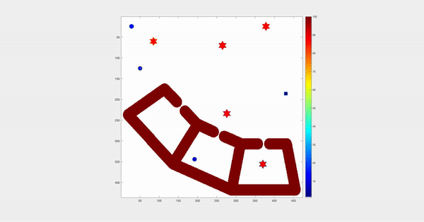

Surveillance by multiple robots

Demo:

To Build - 

`cd src/`

`mex planner.cpp MidGraph.cpp LowGraph.cpp TopGraph.cpp  ComparePriorityLow.cpp ComparePriorityMid.cpp ComparePriorityHigh.cpp`

To Run - 

In MATLAB  
`[plan]=demo()`

