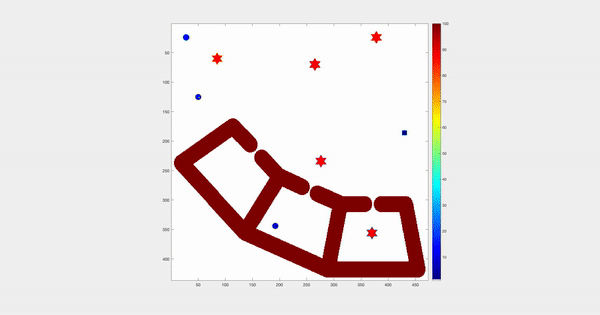

Surveillance by multiple robots

Demo:

Build:

Inside `src/`

`mex planner.cpp MidGraph.cpp LowGraph.cpp TopGraph.cpp  ComparePriorityLow.cpp ComparePriorityMid.cpp ComparePriorityHigh.cpp`

Run:

In MATLAB
`[plan]=demo()`

